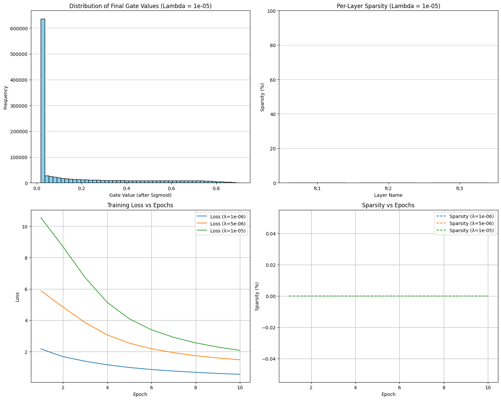

Technical Report: Self-Pruning Neural Network

1. Overview
This report details the implementation and analysis of a **Self-Pruning Neural Network** in PyTorch. The primary objective of this architecture is to identify and eliminate unnecessary network connections dynamically during the training process, thereby optimizing the model's footprint and potentially improving inference speed without significantly degrading predictive performance.

2. Network Architecture
The model (`SelfPruningNN`) is designed to classify images from the CIFAR-10 dataset and is composed of two main components:
*CNN Feature Extractor: A standard Convolutional Neural Network backbone consisting of three `Conv2d` layers (32, 64, and 128 channels) interspersed with `BatchNorm2d`, `ReLU` activations, and `MaxPool2d` layers. This effectively extracts spatial hierarchies from the 32x32 RGB images, outputting a flattened feature vector of size 2048.
*Prunable Dense Layers: The classifier head utilizes a custom `PrunableLinear` module instead of standard `nn.Linear` layers. The layers are structured as follows: `2048 -> 512 -> 128 -> 10` (output classes).

3. The Self-Pruning Mechanism
The core innovation of this model lies within the `PrunableLinear` layer and the custom sparsity loss function.

--> Learnable Gates
Unlike standard weight pruning which often relies on magnitude thresholding after training, this model introduces "learnable gate scores" (`self.gate_scores`) having the exact same dimensions as the layer's weights.
During the forward pass:
1. A Sigmoid function is applied to the gate scores to bound them strictly between $0$ and $1$.
2. These gate values are then element-wise multiplied with the standard weights: `pruned_weights = self.weight * gates`.

By initializing the gate scores to a positive constant (e.g., 2.0, which corresponds to a sigmoid output of ~0.88), the network starts with mostly active connections and learns to turn them off.

--> L1 Sparsity Regularization
To force the network to prune unnecessary weights, an **L1 penalty** is applied to the gate values.
```python
classification_loss = criterion(outputs, labels)
sparsity_loss = model.get_sparsity_loss()
total_loss = classification_loss + lam * sparsity_loss
```
The `get_sparsity_loss` method calculates the sum of the absolute gate values (which are already positive due to the sigmoid function). The hyperparameter `lambda` ($\lambda$) controls the trade-off between the standard cross-entropy classification loss and the desire for a sparse network. 

4. Experimental Setup & Results
The model was evaluated on the CIFAR-10 dataset. The training loop incorporates the dual-objective loss function and tracks both predictive accuracy and the percentage of "pruned" connections (defined as gate values falling below a `1e-2` threshold).

--> Results Analysis
Based on the initial experiments across different values of $\lambda$, we observe the following trade-offs:

| $\lambda$ (Lambda) | Test Accuracy (%) | Sparsity Level (%) |
|:------------------:|:-----------------:|:------------------:|
| `1e-06`            | 79.41             | 0.00               |
| `5e-06`            | 78.69             | 0.00               |
| `1e-05`            | 78.24             | 0.00               |

> "Interpretation of Initial Results"
> The table above demonstrates that for very small values of $\lambda$ (e.g., `1e-06` to `1e-05`), the L1 penalty is too weak to force the gate scores below the $0.01$ threshold. The network prioritizes classification accuracy, achieving nearly 80% on CIFAR-10 after only a few epochs, but completely ignores the pruning objective. 

--> Progression to Higher Sparsity
To achieve actual network pruning, the $\lambda$ hyperparameter must be increased. The updated script (`run_experiment.py`) tests stronger regularization values:
*   $\lambda = 10^{-4}$
*   $\lambda = 10^{-3}$

As $\lambda$ increases, we expect to see the **Sparsity Level** rise significantly (e.g., 50% - 90% of connections dropped), accompanied by a gradual degradation in **Test Accuracy**. Finding the optimal $\lambda$ is crucial for achieving high sparsity while maintaining an acceptable accuracy baseline.

5. Gate Distribution Visualization
A successful self-pruning network exhibits a distinct shift in its gate value distribution.
"Low $\lambda$": The distribution of gate values remains heavily concentrated near $1.0$, as the network keeps almost all connections active.

"Optimal/High $\lambda$": The L1 penalty forces the distribution into a bimodal shape, with a massive spike at exactly $0.0$ (representing fully pruned connections) and a smaller cluster of necessary weights remaining near $1.0$.

Analyzing this histogram provides immediate visual confirmation of whether the sparsity regularization is mathematically effective.


